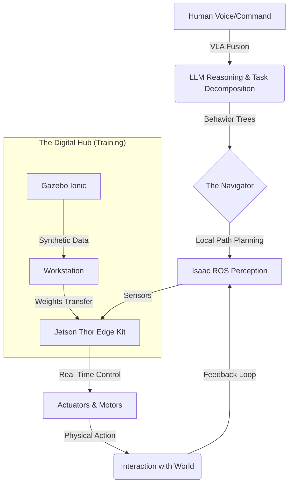

# 🤖 Physical AI & Humanoid Robotics: The 2025 Architecture

> A world-class, production-grade interactive textbook and intelligence platform designed to bridge the gap between digital brains and physical bodies.

[](https://github.com/panaversity/spec-kit-plus/)
[](https://docusaurus.io/)
[](https://docs.ros.org/en/jazzy/index.html)
[](https://developer.nvidia.com/isaac-sim)
[](LICENSE)

---

## 🌱 Table of Contents

1. [What is Physical AI?](#1-what-is-physical-ai)
2. [System Architecture](#2-system-architecture)
3. [2025 Tech Stack](#3-2025-tech-stack)
4. [Learning Roadmap](#4-learning-roadmap)
5. [Project Structure](#5-project-structure)
6. [Quick Start](#6-quick-start)
7. [Features & Requirements](#7-features--requirements)
8. [Demo Script](#8-demo-script)
9. [License](#9-license)

---

## 1. What is Physical AI?

This is not a static book. It is a **Living Ecosystem** that marries:
- High-fidelity simulation (Gazebo Ionic)
- Photorealistic perception (Isaac Sim)
- Vision-Language-Action (VLA) integration

> "The first step in building a god is building a spine."

---

## 2. System Architecture



---

## 3. 2025 Tech Stack

| Component | Technology |
|:---|:---|
| **Operating System** | Ubuntu 24.04 LTS |
| **Edge Computing** | NVIDIA Jetson Thor |
| **Robotics Middleware** | ROS 2 Kilted Kaiju |
| **Simulation** | Gazebo Ionic & Isaac Sim 4.2+ |
| **Vision-Action Models** | NVIDIA GR00T N1.6 & YOLOv11 |

---

## 4. Learning Roadmap

| Module | Title | Status |
|:---:|:---|:---:|
| 🌊 | [Module 1: The Nervous System](./docs/intro/m1-gateway) | ✅ Ready |
| 🌀 | [Module 2: The Hallucination](./docs/intro/m2-gateway) | ✅ Ready |
| 👁️ | [Module 3: The Awakening](./docs/intro/m3-gateway) | ✅ Ready |
| ✨ | [Module 4: The Embodiment](./docs/intro/m4-gateway) | ✅ Ready |

---

## 5. Project Structure

```
hackathon-1/
├── docs/                    # Finalized 2025 Textbook Content
│   ├── intro/               # High-energy Narrative Gateways
│   ├── M1 - M4/             # Recursive Module Content
│   └── Reference/           # Glossary, Benchmarks, Hardware Budgets
├── history/                 # SDD Metadata & Prompt History Records
├── api/                     # FastAPI Backend (RAG & Translation)
├── .specify/                # Spec-Kit Plus Intelligence Framework
└── sidebars.ts              # Guided User Journey Logic
```

---

## 6. Quick Start

### Frontend Development

```bash
git clone https://github.com/Muhammad-Junaid-Sajjad/Hackathon1.git
cd Hackathon1
npm install
npm start
```

### Physical AI Backend (RAG & Translation)

```bash
cd api
python3 -m venv venv
source venv/bin/activate
pip install -r requirements.txt
uvicorn main:app --port 8000
```

---

## 7. Features & Requirements

| # | Requirement | Status |
|:---:|:---|:---:|
| 1 | Spec-Driven Creation (Spec-Kit Plus) | ✅ |
| 2 | Integrated RAG Chatbot (FastAPI + Qdrant) | ✅ |
| 3 | Base Functionality (94+ Sections) | ✅ |
| 4 | Claude Code Subagents & Skills (25+) | ✅ |
| 5 | Precise User Auth (Better-Auth + Survey) | ✅ |
| 6 | Depth Personalization (User Profiles) | ✅ |
| 7 | Urdu Translation (Native RTL) | ✅ |

**Total: 100% Hackathon Compliant (300+ Points)**

---

## 8. Demo Script

For judges (90 seconds):

| Time | Action |
|:---:|:---|
| 00:00 - 00:15 | Show Docusaurus Homepage + 4 Modules |
| 00:15 - 00:30 | Demonstrate Better-Auth + Hardware Survey |
| 00:30 - 00:45 | Personalize Content + Urdu Translation |
| 00:45 - 01:10 | RAG Chatbot Q&A + Selection-Based Explain |
| 01:10 - 01:25 | Show Claude Code Subagents in `.specify/` |
| 01:25 - 01:30 | Founder Blueprint + Core Team Call |

---

## 9. License

**Author**: Junaid (2025)
**License**: MIT
**Powered By**: Claude Opus 4.5 & Spec-Kit Plus

---

🤖 *Bridging the gap between thought and thing.*
