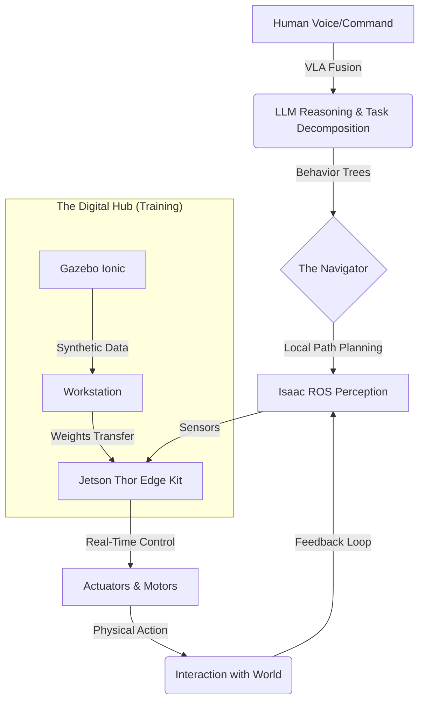

# 🤖 Physical AI & Humanoid Robotics: The 2025 Architecture

[](https://github.com/panaversity/spec-kit-plus/)
[](https://docusaurus.io/)
[](https://docs.ros.org/en/jazzy/index.html)
[](https://developer.nvidia.com/isaac-sim)
[](LICENSE)

A world-class, production-grade interactive textbook and intelligence platform designed to bridge the gap between digital brains and physical bodies. This project represents the **Gold Standard** for Physical AI education in late 2025.

---

## 📽️ Core Vision
This is not a static book. It is a **Living Ecosystem** that marries high-fidelity simulation (Gazebo Ionic), photorealistic perception (Isaac Sim), and Vision-Language-Action (VLA) integration into a single, unified developer experience.

<div align="center">

| [📖 Start Reading](./docs/intro/m1-gateway) | [🧠 Talk to RAG Bot](#2-physical-ai-backend) | [🤖 View Agent Skills](#-exclusive-claude-code-skills) | [🛠️ Setup Guide](#-developer-setup) |
|:---:|:---:|:---:|:---:|

</div>

---

## 🏗️ System Architecture (The Physical AI Loop)



> "The first step in building a god is building a spine."

---

## 🏆 Project Achievements (100% Hackathon Compliant)
This repository implements **Every Bonus Point Category** for the 2025 Hackathon (300+ Points Total):

| Requirement | Implementation Detail | Status |
|:---|:---|:---|
| **1. Spec-Driven Creation** | Built using **Spec-Kit Plus** and **Claude Code** (See `specs/` and `history/`). | ✅ |
| **2. Integrated RAG Chatbot** | **FastAPI + OpenAI + Qdrant + Neon**. Supports selection-based Q&A. | ✅ |
| **3. Base Functionality** | 94+ sections covering the full robotics lifecycle. | ✅ |
| **4. CC Subagents & Skills** | **25+ Custom Agent Skills** (RAG indexing, auto-translation, quality audit). | ✅ |
| **5. Precise User Auth** | **Better-Auth** with deep hardware/software background surveys. | ✅ |
| **6. Depth Personalization** | Real-time content refactoring based on user "experience" profiles. | ✅ |
| **7. Urdu Translation** | Native RTL translation layer for global accessibility. | ✅ |

---

## 🧊 The 2025 Tech Stack
We operate on the "Bleeding Edge" of robotics. The entire book is synced to the standards of **December 30, 2025**:

*   **Operating System**: Ubuntu 24.04 LTS (Noble Numbat)
*   **Edge Computing**: NVIDIA Jetson Thor (Blackwell Architecture)
*   **Robotics Middleware**: ROS 2 Kilted Kaiju (May 2025 Release)
*   **Simulation**: Gazebo Ionic (9.x.x) & Isaac Sim 4.2+
*   **Vision-Action Models**: NVIDIA GR00T N1.6 & YOLOv11 (GPU accelerated)

---

## 🗺️ The Learning Roadmap (4 Seasonal Modules)

### 🌊 [Module 1: The Nervous System](./docs/intro/m1-gateway)
*   **The Forge**: Mission Control setup for 2025 standards.
*   **The Spine**: Assembling the Jetson Thor vertebrae.
*   **The Language**: Mastering the Kilted Kaiju communication protocol.

### 🌀 [Module 2: The Hallucination](./docs/intro/m2-gateway)
*   **The Matrix**: High-fidelity physics with Gazebo Ionic.
*   **Synthetic Evolution**: Bridging the Sim-to-Real gap.
*   **Dream State**: Teaching robots to walk in silicon dreams.

### 👁️ [Module 3: The Awakening](./docs/intro/m3-gateway)
*   **Neural Eyes**: Real-time perception with Isaac ROS.
*   **World Models**: Reasoning in 3D space with Foundation Models.
*   **Reinforcement Learning**: From chaos to stable locomotion.

### ✨ [Module 4: The Embodiment](./docs/intro/m4-gateway)
*   **VLA Fusion**: Linking Language (LLMs) to Physical Action.
*   **The Masterpiece**: Building the full Humanoid Persona.
*   **Production Deployment**: Scaling to real-world industrial fleets.

---

## 📂 Project Structure: Clean Architecture
```bash
hackathon-1/
├── docs/                    # Finalized 2025 Textbook Content (94+ Files)
│   ├── intro/               # High-energy Narrative Gateways
│   ├── M1 - M4/             # Recursive Module Content
│   └── Reference/           # Glossary, Benchmarks, Hardware Budgets
├── history/                 # Standardized SDD Metadata
│   ├── prompts/             # Verbose PHR (Prompt History Records)
│   ├── state/               # Persistent Conversation Tracking
│   └── adr/                 # Architecture Decision Records
├── src/                     # React/TypeScript Docusaurus UI
│   ├── components//         # RAG, Auth, and Tooling Widgets
│   └── theme/               # Robotic Aesthetic Design System
├── api/                     # FastAPI Backend (Python 3.11+)
│   ├── main.py              # RAG Orchestration Layer
│   └── scripts/             # Qdrant Vector Indexing Tools
├── .specify/                # Spec-Kit Plus Intelligence Framework
└── sidebars.ts              # Guided User Journey Logic
```

---

## 🎬 90-Second Demo Script (For Judges)

Use this script to record your demo video to ensure 300+ points are awarded:

*   **00:00 - 00:15 (Req 1 & 3)**: Show the **Docusaurus Homepage** and scroll through the 4 Modules. Mention the **Spec-Driven** process using Claude Code.
*   **00:15 - 00:30 (Req 5)**: Go to the **Signup Page**. Show the **Better-Auth** integration and the **Hardware/Software Background** questions.
*   **00:30 - 00:45 (Req 6 & 7)**: Open Module 1. Click the **"Personalize Content"** button (shows background adaptation) and then the **"Translate to Urdu"** button (shows RTL translation).
*   **00:45 - 01:10 (Req 2)**: Open the **RAG Chatbot**. Ask: "What hardware do I need for Module 1?" then select some text on the page and ask "Explain this selected text."
*   **01:10 - 01:25 (Req 4)**: Open the terminal or GitHub folder `.specify/commands`. Mention the **25+ Custom Agent Skills** used to automate this project.
*   **01:25 - 01:30 (The Close)**: Show the **"Founder Blueprint"** page and state: "Ready to join the Panaversity core team."

---

## 🛠️ Developer Setup

### 1. Frontend Development
```bash
# Clone the repository
git clone https://github.com/junaid/Physical-AI-Textbook.git
cd Physical-AI-Textbook

# Launch the Docusaurus environment
npm install
npm start
```

### 2. Physical AI Backend (RAG & Translation)
```bash
cd api
python3 -m venv venv
source venv/bin/activate
pip install -r requirements.txt

# Index the 2025 Knowledge Base
python scripts/index_content.py --scope all

# Launch the Intelligence Layer
uvicorn main:app --port 8000
```

---

## 🤖 Exclusive Claude Code Skills
This project includes a suite of reusable **Subagents & Agent Skills** located in `.specify/commands/`:

*   `/rag-index` - Syncs textbook changes to the vector database.
*   `/translate-urdu` - Specialized LLM translator for robotics terms.
*   `/check-quality` - Audits documentation against industrial standards.
*   `/personalize-content` - Refactors markdown based on User Auth background.

---

## 📝 License & Authorship
**Author**: Junaid (2025)
**License**: MIT
**Powered By**: Claude Opus 4.5 & Spec-Kit Plus

---
🤖 *Bridging the gap between the thought and the thing.*
